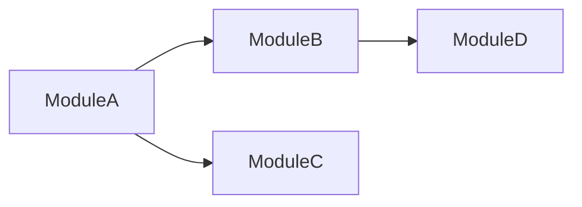

# 生成项目总览

## 概述

此技能根据多个现有的模块设计文档生成项目级总览文档和模块设计文档索引。

## 使用场景

- 用户有多个项目的模块设计文档
- 需要创建统一的项目总览
- 想要生成模块索引以便更好地导航
- 开始新一轮的文档工作

## 工作流程

### 第一步：收集用户输入

1. **模块设计文档**：请用户提供：
   - 多个模块设计文档文件（Markdown）
   - 或包含多个模块设计文档的目录
   - 验证所有文件存在且可读

2. **代码仓库**：请用户选择代码仓库路径
   - 必须是有效的本地路径
   - 用于整体项目结构分析

3. **输出目录**：请用户指定保存总览文档的位置
   - 默认为项目根目录下的 `docs/` 文件夹

### 第二步：分析每个模块设计文档

对于每个模块设计文档：

1. 解析 Markdown 内容
2. 提取：
   - 模块名称
   - 模块描述/目的
   - 关键功能
   - 对其他模块的依赖
   - 数据模型
   - API 端点

### 第三步：分析代码仓库结构

使用 Claude API 进行分析：

1. **项目结构**
   - 根目录及其用途
   - 主入口点
   - 配置文件

2. **技术栈**
   - 编程语言
   - 使用的框架
   - 关键库

3. **模块关系**
   - 模块之间的依赖
   - 共享组件
   - API 契约

### 第四步：生成项目总览文档

创建 Markdown 文档，包含：

1. **项目总览**
   - 项目名称
   - 项目目的
   - 技术栈

2. **架构图**
   - 使用 Mermaid C4 图表展示：
     - 系统上下文
     - 容器
     - 关键组件

3. **模块列表**
   - 每个模块及简要描述
   - 详细模块设计文档的链接

4. **模块依赖**
   - 使用 Mermaid 展示依赖关系

### 第五步：生成模块索引

创建索引文档，包含：

1. **模块索引表**
   | # | 模块名称 | 功能描述 | 负责人 | 文档路径 |
   |---|----------|----------|--------|----------|

2. **交叉引用**
   - 按功能区域
   - 按依赖顺序

### 第六步：模板自我增强

生成总览后，询问用户：

> "是否启用模板自我增强？这将帮助根据本次执行结果改进模板。"

如果用户同意：
1. 展示生成的总览供用户审阅
2. 请用户确认或修改部分内容
3. 根据用户反馈更新模板

## 输出格式

### 项目总览文档

```markdown
# 项目名称

## 1. 项目概述

### 1.1 项目目的
...

### 1.2 技术栈
- Language: ...
- Framework: ...
- Database: ...
- Others: ...

## 2. 系统架构

### 2.1 整体架构图
```mermaid
C4Context
    title System Context Diagram
    ...
```

### 2.2 容器图
```mermaid
C4Container
    title Container Diagram
    ...
```

## 3. 模块概览

### 3.1 模块列表

| 模块名称 | 功能描述 | 依赖模块 |
|----------|----------|----------|
| Module A | ... | Module B |
| Module B | ... | - |

### 3.2 模块依赖关系


## 4. 详细模块设计文档

- [模块A设计文档](docs/modules/module-a-design.md)
- [模块B设计文档](docs/modules/module-b-design.md)
...
```

### 模块索引文档

```markdown
# 模块设计文档索引

## 索引表

| # | 模块名称 | 功能描述 | 文档路径 |
|---|----------|----------|----------|
| 1 | 模块A | 用户认证模块 | docs/modules/auth-design.md |
| 2 | 模块B | 订单管理模块 | docs/modules/order-design.md |

## 按功能区域索引

### 用户相关
- 模块A: 用户认证

### 业务相关
- 模块B: 订单管理

## 版本信息

| 版本 | 日期 | 变更内容 |
|------|------|----------|
| v1.0 | 2024-01-01 | 初始版本 |
```

## 关键原则

1. **聚合现有文档** - 不要重新创建模块细节
2. **展示关系** - 可视化模块依赖
3. **提供导航** - 使查找特定模块变得容易
4. **使用 C4 图表** - 多层次展示架构
5. **请求用户确认** - 验证关键信息
6. **支持自我增强** - 根据反馈改进模板
