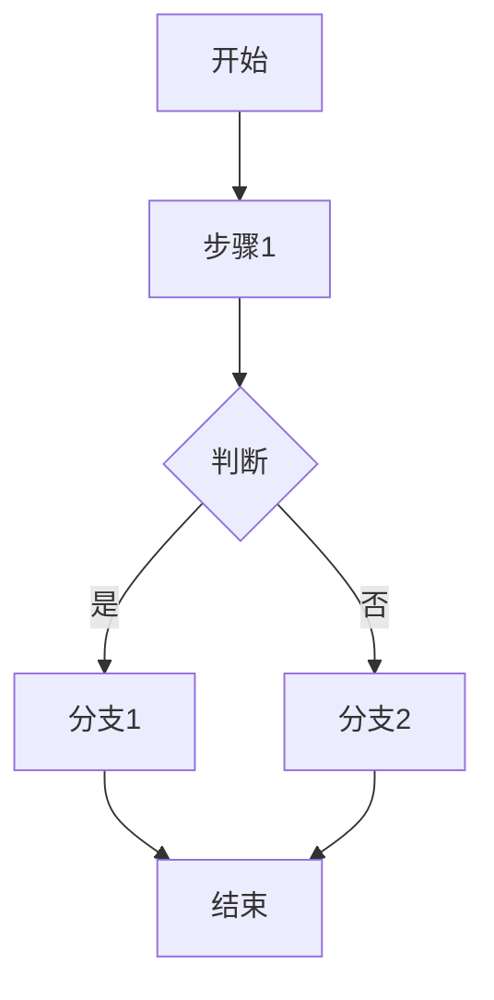
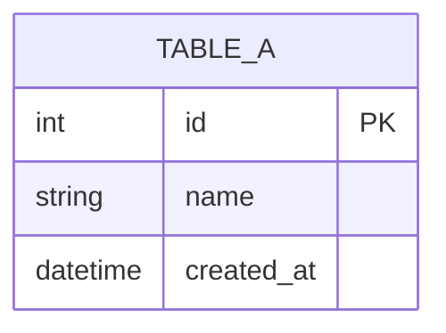
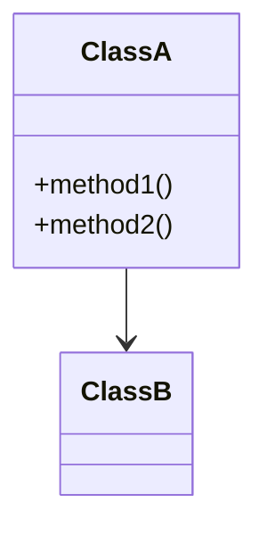

# 反向生成模块设计文档

## 概述

此技能仅通过代码分析来生成模块设计文档，不需要任何现有的设计文档。这对于记录遗留代码或创建初始设计文档非常有用。

## 使用场景

- 没有现有的设计文档
- 需要记录遗留/仅实现代码的文档
- 为新模块启动文档
- 对现有系统进行逆向工程

## 工作流程

### 第一步：收集用户输入

1. **代码仓库**：请用户选择代码仓库路径
   - 必须是有效的本地路径
   - 包含要记录的模块

2. **模块范围**：请用户指定要记录的代码部分：
   - 整个仓库
   - 特定目录
   - 特定文件

3. **输出目录**：请用户指定保存设计文档的位置
   - 默认为项目根目录下的 `docs/` 文件夹
   - 如果未指定，创建 `docs/` 目录

4. **输出文件名**：请用户指定输出文件名
   - 默认为 `{模块名}-design.md`

### 第二步：选择模板

向用户展示 4 种模板选项：

| 模板 | 侧重点 |
|------|--------|
| **普通功能类** | 基础功能、业务逻辑、接口定义 |
| **管理系统类** | CRUD 操作、数据流、权限控制、状态管理 |
| **算法类** | 算法流程、时间/空间复杂度、边界情况处理 |
| **中间件类** | 底层通信、协议处理、性能优化、容错机制 |

用户也可以选择自定义或提供自己的模板。

### 第三步：分析代码

使用 Claude API 进行全面分析：

1. **业务/算法流程**
   - 识别主要入口点
   - 追踪执行流程
   - 拆解为子流程
   - 生成 Mermaid 流程图

2. **数据模型**
   - 识别数据结构
   - 数据库表（如果有）
   - 输入/输出参数
   - 生成 Mermaid ERD 图

3. **类/模块结构**
   - 识别主要类及其职责
   - 包结构
   - 公共 API
   - 依赖关系
   - 生成 Mermaid 类图

4. **时序图**
   - 关键交互流程
   - API 调用序列
   - 事件处理

### 第四步：生成设计文档

创建 Markdown 文档，包含：

1. 基于所选模板的全面概述
2. Mermaid 图表：
   - 业务流程流程图
   - 交互时序图
   - 结构类图
   - 数据 ERD 图
3. 详细说明
4. 版本历史部分

### 第五步：模板自我增强

生成文档后，询问用户：

> "是否启用模板自我增强？这将帮助根据本次执行结果改进模板。"

如果用户同意：
1. 展示生成的内容供用户审阅
2. 请用户确认或修改具体部分
3. 根据用户反馈更新模板

## 输出格式

所有设计文档均以 Markdown 格式呈现，采用模板特定的结构：

### 普通功能类模板

```markdown
# 模块名称

## 1. 功能概述
模块的主要功能描述

## 2. 业务流程
### 2.1 主流程


### 2.2 子流程1
...

## 3. 数据模型
### 3.1 输入数据结构
```typescript
interface InputData {
    field1: string;
    field2: number;
}
```

### 3.2 输出数据结构
...

### 3.3 数据库表结构


## 4. 接口设计
### 4.1 API 列表
| 方法 | 路径 | 说明 |
|------|------|------|
| GET | /api/xxx | 获取xxx |

## 5. 类图


## 6. 核心逻辑
...

## 版本变更记录

| 版本 | 日期 | 变更内容 | 变更人 |
|------|------|----------|--------|
| v1.0 | 2024-01-01 | 初始版本 | - |
```

### 管理系统类模板

包含额外部分：
- CRUD 操作详情
- 权限控制模型
- 状态机图

### 算法类模板

包含额外部分：
- 时间复杂度分析
- 空间复杂度分析
- 边界情况处理
- 伪代码

### 中间件类模板

包含额外部分：
- 协议格式
- 性能优化策略
- 容错机制
- 连接管理

## 关键原则

1. **全面分析代码** - 不要遗漏任何重要细节
2. **生成全面的图表** - 流程图、时序图、类图、ERD
3. **分解复杂流程** - 拆解为子流程
4. **记录所有公共接口** - API、函数、类
5. **请求用户确认** - 验证关键部分
6. **支持自我增强** - 根据反馈改进模板
