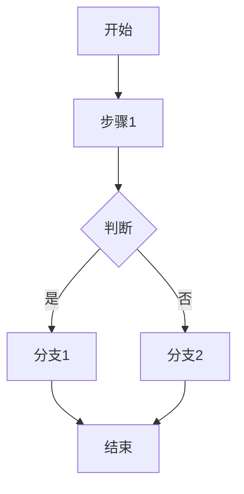
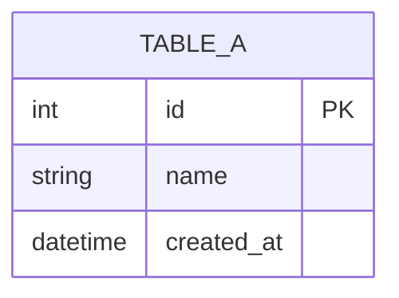
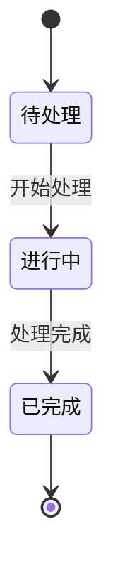
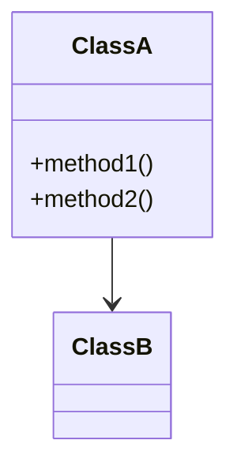

# 模块名称

## 1. 功能概述
模块的主要功能描述

## 2. 业务流程
### 2.1 主流程

### 2.2 子流程1
...

## 3. 数据模型
### 3.1 输入/输出结构
...

### 3.2 数据库表结构

## 4. CRUD 操作详情
### 4.1 Create（创建）
...

### 4.2 Read（读取）
...

### 4.3 Update（更新）
...

### 4.4 Delete（删除）
...

## 5. 权限控制模型
### 5.1 角色定义
...

### 5.2 权限矩阵
| 角色 | 操作1 | 操作2 | 操作3 |
|------|-------|-------|-------|
| 管理员 | ✓ | ✓ | ✓ |
| 普通用户 | ✓ | ✗ | ✗ |

## 6. 状态机图

## 7. 类图

## 8. 接口设计
### 8.1 API 列表
| 方法 | 路径 | 说明 |
|------|------|------|
| GET | /api/xxx | 获取xxx |
| POST | /api/xxx | 创建xxx |
| PUT | /api/xxx/:id | 更新xxx |
| DELETE | /api/xxx/:id | 删除xxx |

## 9. 核心逻辑
...

## 版本变更记录

| 版本 | 日期 | 变更内容 | 变更人 |
|------|------|----------|--------|
| v1.0 | 2024-01-01 | 初始版本 | - |
