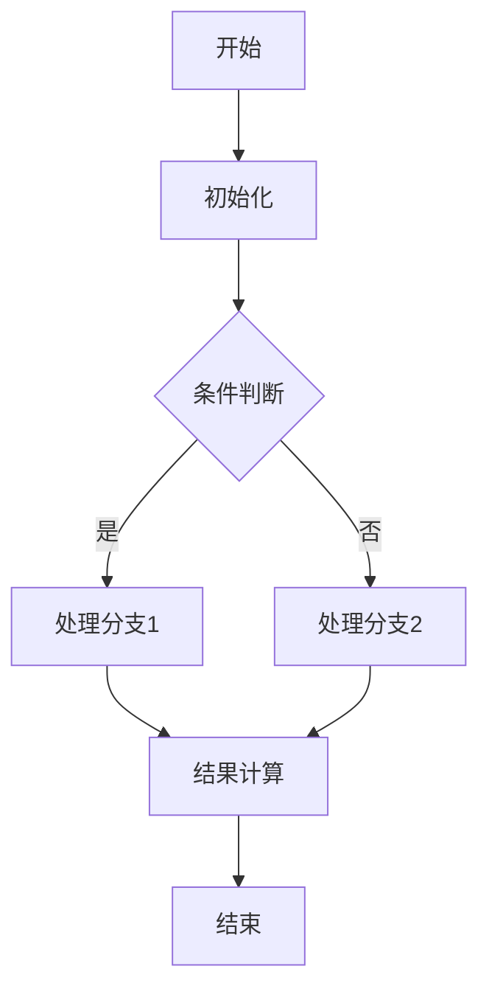
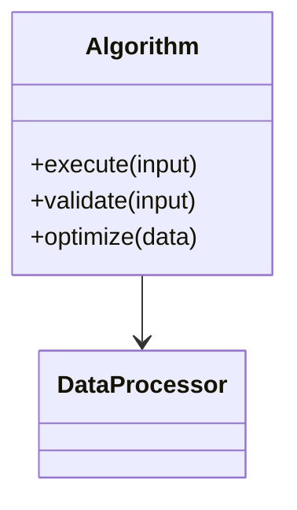
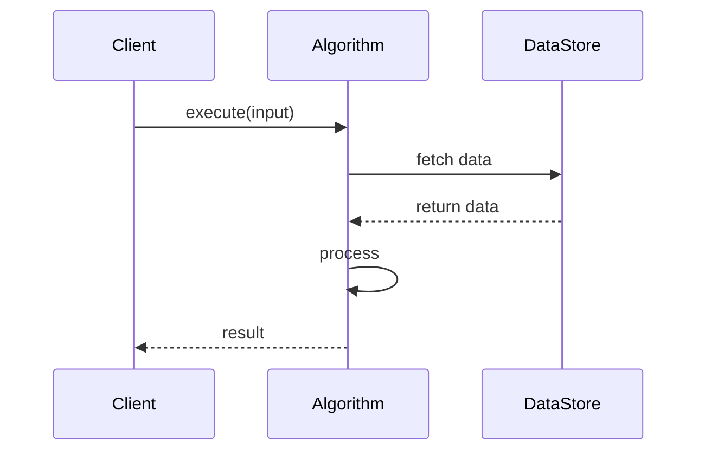

# 模块名称

## 1. 功能概述
模块的主要功能描述

## 2. 算法流程
### 2.1 主算法流程


### 2.2 子算法流程
...

## 3. 伪代码

```
function algorithm(input):
    // 初始化
    result = init()

    // 主循环
    for each item in input:
        // 处理每个元素
        processed = process(item)
        result.add(processed)

    // 返回结果
    return result
```

## 4. 时间复杂度分析

| 场景 | 时间复杂度 | 说明 |
|------|------------|------|
| 最好情况 | O(1) | ... |
| 平均情况 | O(n) | ... |
| 最坏情况 | O(n²) | ... |

## 5. 空间复杂度分析

| 场景 | 空间复杂度 | 说明 |
|------|------------|------|
| 额外空间 | O(n) | ... |
| 递归栈 | O(log n) | ... |

## 6. 边界情况处理

### 6.1 空输入
...

### 6.2 边界值
...

### 6.3 异常情况
...

## 7. 数据模型
### 7.1 输入数据结构
```typescript
interface InputData {
    field1: string;
    field2: number;
}
```

### 7.2 输出数据结构
...

## 8. 类图


## 9. 时序图


## 版本变更记录

| 版本 | 日期 | 变更内容 | 变更人 |
|------|------|----------|--------|
| v1.0 | 2024-01-01 | 初始版本 | - |
