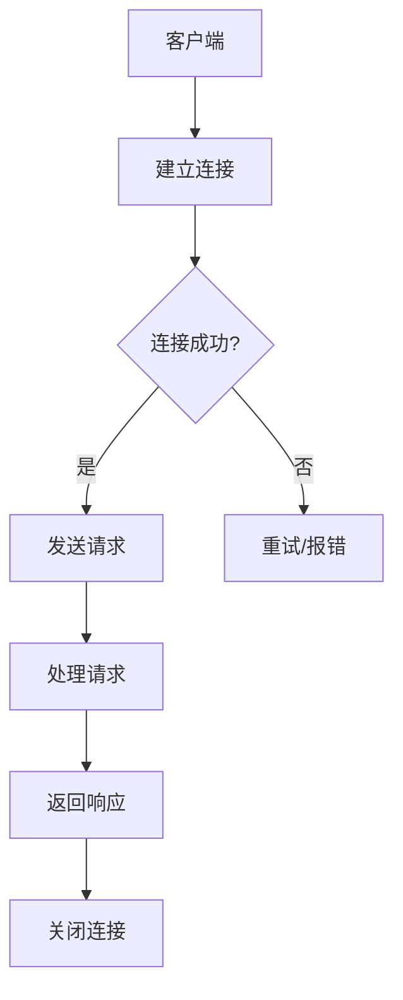
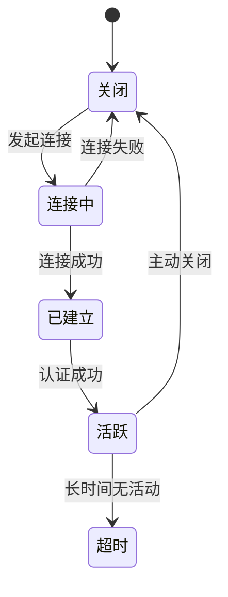
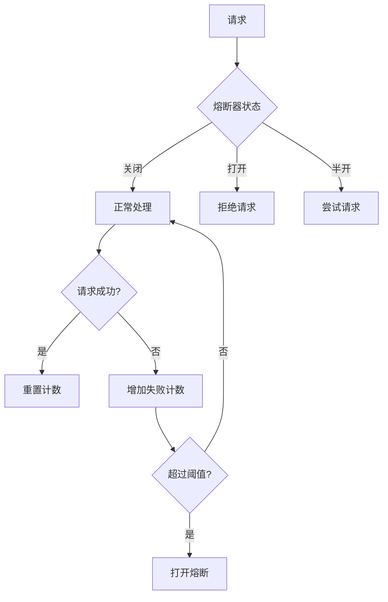
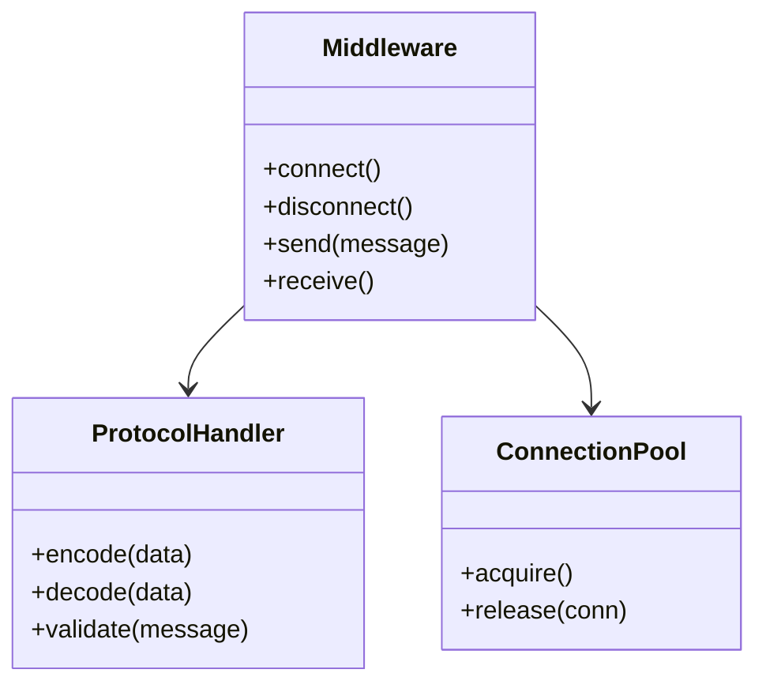
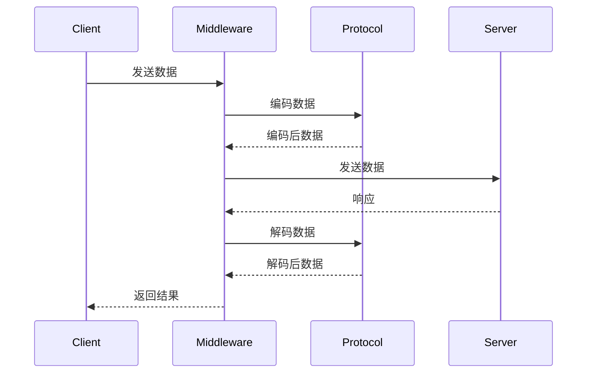

# 模块名称

## 1. 功能概述
模块的主要功能描述

## 2. 通信流程
### 2.1 主通信流程


### 2.2 协议握手流程
...

## 3. 协议格式
### 3.1 数据包结构
```
+--------+--------+--------+--------+
| Header | Length | Payload| Checksum|
+--------+--------+--------+--------+
```

### 3.2 字段说明
| 字段 | 长度 | 说明 |
|------|------|------|
| Header | 4 字节 | 协议标识 |
| Length | 4 字节 | 数据长度 |
| Payload | 变长 | 数据内容 |
| Checksum | 2 字节 | 校验和 |

## 4. 连接管理
### 4.1 连接状态机


### 4.2 连接池配置
...

## 5. 容错机制
### 5.1 重试策略
| 重试次数 | 延迟 | 说明 |
|----------|------|------|
| 1 | 100ms | 首次重试 |
| 2 | 500ms | 第二次重试 |
| 3 | 1000ms | 第三次重试 |

### 5.2 降级策略
...

### 5.3 熔断机制


## 6. 性能优化策略
### 6.1 缓冲区管理
...

### 6.2 零拷贝优化
...

### 6.3 连接复用
...

## 7. 数据模型
### 7.1 消息结构
```typescript
interface Message {
    type: string;
    payload: Buffer;
    timestamp: number;
    sequence: number;
}
```

## 8. 类图


## 9. 时序图


## 版本变更记录

| 版本 | 日期 | 变更内容 | 变更人 |
|------|------|----------|--------|
| v1.0 | 2024-01-01 | 初始版本 | - |
