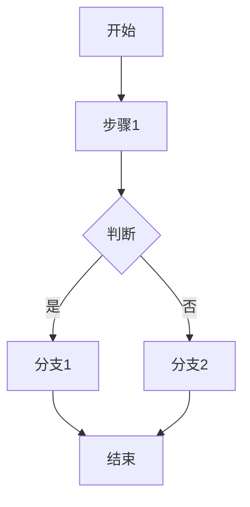
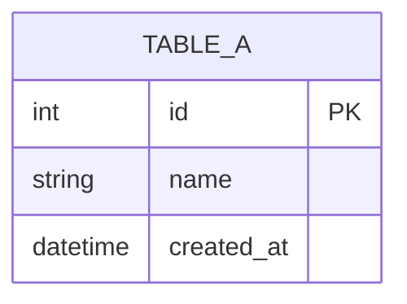
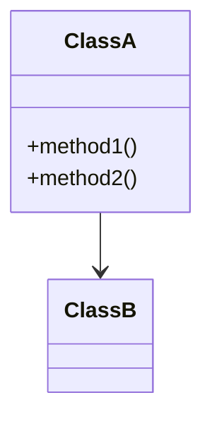

# 模块名称

## 1. 功能概述
模块的主要功能描述

## 2. 业务流程
### 2.1 主流程


### 2.2 子流程1
...

## 3. 数据模型
### 3.1 输入数据结构
```typescript
interface InputData {
    field1: string;
    field2: number;
}
```

### 3.2 输出数据结构
...

### 3.3 数据库表结构


## 4. 接口设计
### 4.1 API 列表
| 方法 | 路径 | 说明 |
|------|------|------|
| GET | /api/xxx | 获取xxx |

## 5. 类图


## 6. 核心逻辑
...

## 版本变更记录

| 版本 | 日期 | 变更内容 | 变更人 |
|------|------|----------|--------|
| v1.0 | 2024-01-01 | 初始版本 | - |
