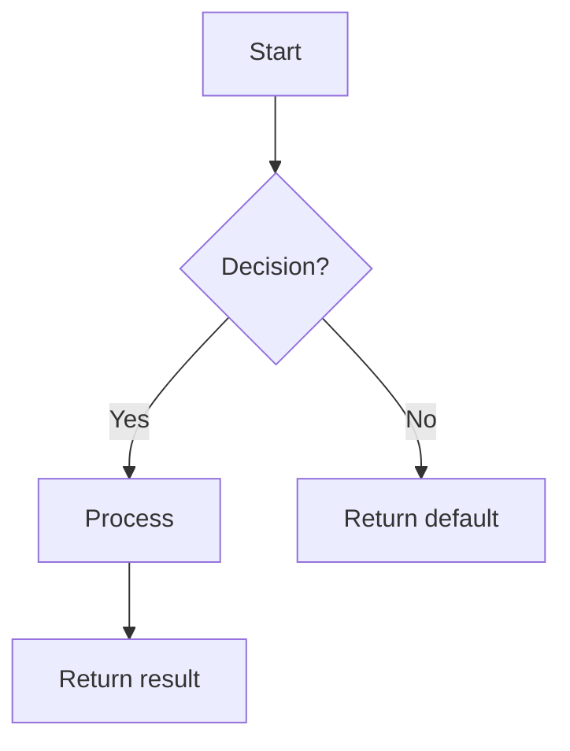

# 特性详细设计：[特性标题]（特性 #ID）

**日期**：YYYY-MM-DD
**特性**：#ID — [标题]
**优先级**：高/中/低
**依赖**：[列表或"无"]
**设计参考**：docs/plans/YYYY-MM-DD-<topic>-design.md § 4.N
**SRS 参考**：FR-xxx

## 上下文

[1-2 句话：此特性做什么以及为什么重要]

## 设计对齐

[在这里复制完整的设计节 §4.N 内容 — 包括类图、序列图和设计决策。包含 Mermaid 代码块逐字复制，使设计对子代理执行自包含。]

- **关键类**：[来自类图 — 要创建/修改的类及关键方法]
- **交互流**：[来自序列图 — 关键调用链]
- **第三方依赖**：[来自依赖表 — 确切库版本]
- **偏差**：[无，或用用户批准注释解释偏差]

## SRS 需求

[复制 SRS 中完整的 FR-xxx 节 — EARS 语句、验收标准、Given/When/Then 场景]

## 组件数据流图

[Mermaid `graph` 或 `flowchart`，显示此特性内部组件之间的运行时数据流。用数据类型标记边。包括外部依赖为虚线边框框。]

> N/A — [原因，例如"single-class feature, see Interface Contract below"]

## 接口契约

| 方法 | 签名 | 前置条件 | 后置条件 | 抛出 |
|--------|-----------|---------------|----------------|--------|
| `method_name` | `method_name(param: Type, ...) -> ReturnType` | [呼叫前必须为真的] | [呼叫后保证的] | [异常 + 条件] |

**设计理由**（每个非显而易见决策一行）：
- [例如，为什么阈值默认为 0.6，为什么参数 X 是可选的]
- **跨特性契约对齐**：如果此特性在设计 §6.2 中作为 Provider 或 Consumer 出现，对应方法的签名必须匹配 §6.2 模式。记录契约 ID（例如，IAPI-001）以供追溯。

## 视觉渲染契约（仅 ui: true）

> N/A — [原因，例如"backend-only feature, no visual output"]

| 视觉元素 | DOM/Canvas 选择器 | 渲染时机 | 视觉状态变体 | 最小尺寸 | 数据源 |
|----------------|---------------------|---------------|----------------------|-------------------|-------------|
| [例如，蛇身体段] | `canvas#game-board` or `div.snake-segment` | [on game tick / on page load] | [alive=green, dead=red, paused=grey] | [20x20px per cell] | [GameState.segments[]] |

**渲染技术**：[Canvas 2D / WebGL / DOM 元素 / SVG / CSS animation]
**入口点函数**：[例如，`GameRenderer.draw()` called from `gameLoop()`]
**渲染触发器**：[例如，requestAnimationFrame loop / event-driven / reactive state]

**正向渲染断言**（触发后，这些必须视觉上存在）：
- [ ] [Element 1 is drawn/visible with dimensions > 0]
- [ ] [Element 2 shows data from state]
- [ ] [Container is not empty / canvas has non-transparent pixels]

**交互深度断言**（渲染元素必须响应其设计的交互 — 无交互的渲染是"仅显示"缺陷）：
- [ ] [Element 1 responds to [key press / click / drag] → visual output changes]
- [ ] [Element 2 updates on [state change / user input] → displayed data refreshes]

## 内部序列图

[Mermaid `sequenceDiagram`，显示此特性**实现内部**的方法到方法调用。覆盖主要成功路径 + 每个 Raises 条目至少一个错误路径。]

> N/A — [原因，例如"single-class implementation, error paths documented in Algorithm error handling table"]

## 算法 / 核心逻辑

### [方法名称]

#### 流程图



#### 伪代码

```
FUNCTION name(param1: Type, param2: Type) -> ReturnType
  // Step 1: [major step]
  // Step 2: [formula or key decision]
  // Step 3: [edge case handling]
  RETURN result
END
```

#### 边界决策

| 参数 | 最小 | 最大 | 空/空值 | 在边界 |
|-----------|-----|-----|------------|-------------|
| [param]   | [val] | [val] | [behavior] | [behavior] |

#### 错误处理

| 条件 | 检测 | 响应 | 恢复 |
|-----------|-----------|----------|----------|
| [condition] | [how detected] | [exception or default] | [caller action] |

> N/A — [原因，例如"pure CRUD, no algorithm" or "Delegates to [X] — see Feature #N"]

## 状态图

[Mermaid `stateDiagram-v2`，显示所有有效状态、转换、触发器和守卫条件]

> N/A — [原因，例如"stateless feature"]

## 测试清单

| ID | 类别 | 可追溯到 | 输入 / 设置 | 预期 | 消灭哪个 Bug？ |
|----|----------|-----------|---------------|----------|-----------------|
| A  | FUNC/happy | FR-xxx AC-1 | [specific values] | [exact result] | [wrong impl this catches] |
| B  | FUNC/error | §Interface Contract Raises | [trigger condition] | [exception type + msg] | [missing branch] |
| C  | BNDRY/edge | §Algorithm boundary table | [edge value] | [exact behavior] | [off-by-one or missing guard] |
| D  | FUNC/state | §State Diagram transition | [pre-state + event] | [post-state] | [missing guard condition] |
| E  | INTG/db    | §Interface Contract + required_configs | [real DB setup] | [data persisted + queryable] | [connection not established / wrong table] |
| F  | INTG/api   | §4.N cross-service call | [real HTTP endpoint] | [correct response schema] | [wrong endpoint / timeout not handled] |
| G  | UI/render  | §Visual Rendering Contract | [page loaded, game started] | [canvas has non-transparent pixels / DOM element visible with dimensions > 0] | [render function never called / canvas blank / DOM element not appended] |

类别格式：`MAIN/subtag`，其中 MAIN 是 `FUNC、BNDRY、SEC、UI、PERF、INTG` 之一，subtag 是自由形式标签。

如果特性没有外部依赖（纯计算、无 IO、无 DB、无网络），添加明确注释：
> INTG: N/A — pure function, no external I/O

## 任务

### 任务 1：编写失败测试
**文件**：[确切路径]
**步骤**：
1. 创建带导入的测试文件
2. 为测试清单中的每行编写测试代码：
   - 测试 A：[匹配表行 A]
   - 测试 B：[匹配表行 B]
3. 运行：`[test command]`
4. **预期**：所有测试因正确原因 FAIL

### 任务 2：实现最小代码
**文件**：[确切路径]
**步骤**：
1. [引用算法伪代码的精确更改]
2. [引用接口契约的精确更改]
3. 运行：`[test command]`
4. **预期**：所有测试 PASS

### 任务 3：覆盖率门控
1. 运行：`[coverage command]`
2. 检查阈值。如果低于：返回任务 1。
3. 记录覆盖率输出作为证据。

### 任务 4：重构
1. [特定重构操作]
2. 运行完整测试套件。所有测试 PASS。

### 任务 5：突变门控
1. 运行：`[mutation command] --paths-to-mutate=<changed-files>`
2. 检查阈值。如果低于：改进断言。
3. 记录突变输出作为证据。

## 验证检查清单
- [ ] 所有 SRS 验收标准（来自 srs_trace）可追溯到接口契约后置条件
- [ ] 所有 SRS 验收标准（来自 srs_trace）可追溯到测试清单行
- [ ] 算法伪代码覆盖所有非平凡方法
- [ ] 边界表覆盖所有算法参数
- [ ] 错误处理表覆盖所有 Raises 条目
- [ ] 测试清单负率 >= 40%
- [ ] ui:true 特性的视觉渲染契约完整（列出所有视觉元素、定义正向渲染断言）
- [ ] 每个视觉渲染契约元素有 ≥1 UI/render 测试清单行
- [ ] 每个跳过的节有明确的"N/A — [原因]"

## 澄清附录

> 无需澄清 — 所有规范都无歧义。

| # | 类别 | 原始歧义 | 解决方案 | Authority |
|---|----------|--------------------|------------|-----------|
| — | — | — | — | user-approved / assumed |

<!-- 此节由 SubAgent 在以下情况下填充：
     1. 低影响歧义被假设（Authority = "assumed"）
     2. 通过重新派遣提供用户批准的解决方案（Authority = "user-approved"）
     Feature-ST 读取此节以避免重新询问已解决的问题。 -->
